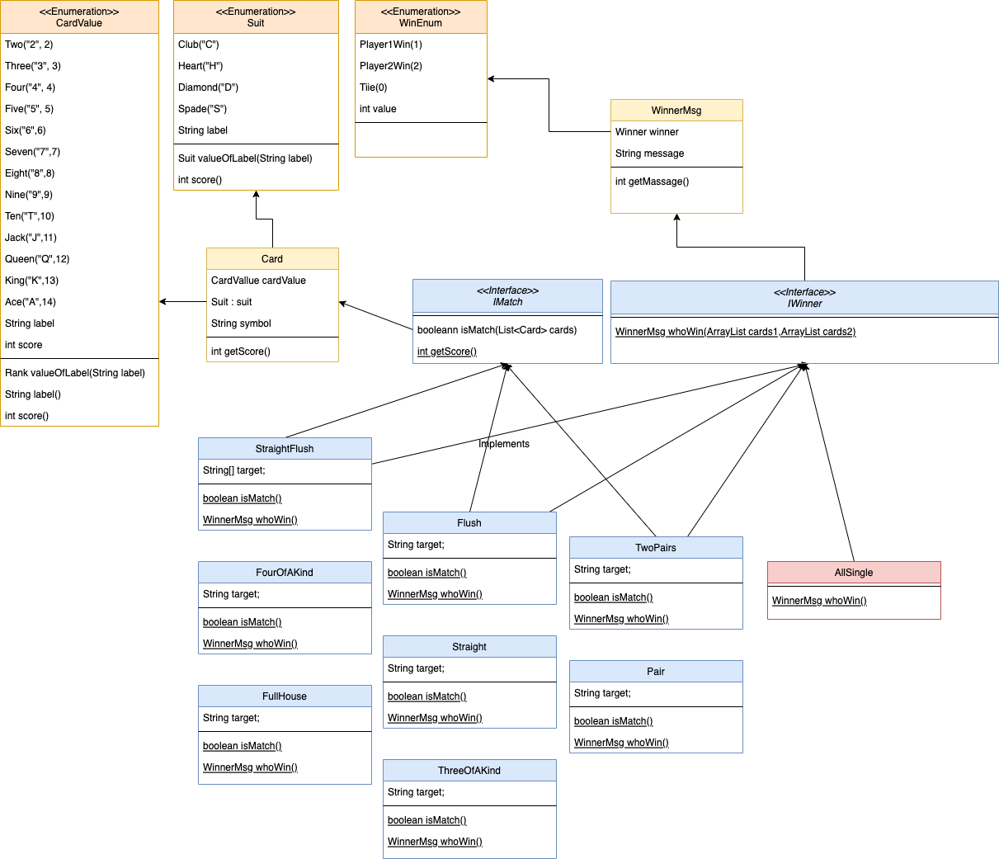

# Poker Hand Kata

## Overview
Poker is a card game that involves both luck and strategy. The game is typically played with a standard deck of 52 cards, although variations of the game may use additional cards or different card rankings.
The objective of this kata is to compare several pairs of poker hands and to indicate which, if either, has a higher rank.

## UML Diagram

## Features
- The use of enums provides a structured way to represent the different cards and suits, which makes it easier to implement other card games.
- When comparing pairs of poker hands, the ranking of the hands can be determined by evaluating the strength of each player's combination. For example, if two players have a pair of aces and a pair of kings, the player with the pair of aces would have the stronger hand, as aces are ranked higher than kings. If both players have the same pair, the strength of the remaining cards in each hand would determine the winner.

## Assumptions
- A poker deck contains 52 cards - each card has a suit which is one of clubs, diamonds, hearts, or spades (denoted C, D, H, and S in the input data).
- Each card also has a value which is one of 2, 3, 4, 5, 6, 7, 8, 9, 10, jack, queen, king, ace (denoted 2, 3, 4, 5, 6, 7, 8, 9, T, J, Q, K, A).
- For scoring purposes, the suits are unordered while the values are ordered as given above, with 2 being the lowest and ace the highest value.
- A poker hand consists of 5 cards dealt from the deck.

## Ranking
Poker hands are ranked by the following partial order from lowest to highest. 
- High Card: Hands which do not fit any higher category are ranked by the value of their highest card. If the highest cards have the same value, the hands are ranked by the next highest, and so on.
- Pair: 2 of the 5 cards in the hand have the same value. Hands which both contain a pair are ranked by the value of the cards forming the pair. If these values are the same, the hands are ranked by the values of the cards not forming the pair, in decreasing order.
- Two Pairs: The hand contains 2 different pairs. Hands which both contain 2 pairs are ranked by the value of their highest pair. Hands with the same highest pair are ranked by the value of their other pair. If these values are the same the hands are ranked by the value of the remaining card.
- Three of a Kind: Three of the cards in the hand have the same value. Hands which both contain three of a kind are ranked by the value of the 3 cards.
- Straight: Hand contains 5 cards with consecutive values. Hands which both contain a straight are ranked by their highest card.
- Flush: Hand contains 5 cards of the same suit. Hands which are both flushes are ranked using the rules for High Card.
- Full House: 3 cards of the same value, with the remaining 2 cards forming a pair. Ranked by the value of the 3 cards.
- Four of a kind: 4 cards with the same value. Ranked by the value of the 4 cards.
- Straight flush: 5 cards of the same suit with consecutive values. Ranked by the highest card in the hand.

## TDD Approaches
| Test Class        | input csv                 | classes             | method tested                                                                                                                                                          | Description                                                           |
|-------------------|---------------------------|---------------------|------------------------------------------------------------------------------------------------------------------------------------------------------------------------|-----------------------------------------------------------------------|
| AllSingleTest     | AllSingleTestcases.csv    | AllSingle           | allSingle.whoWin()                                                                                                                                                     | Ranked by the highest card in the hand.                               |
| CardTest          | n/a                       | Card CardValue Suit | card.getSymbol()                                                                                                                                                       | parse the input like 'TS' to construct Card                           |
| FlushTest         | FlushTestcases.csv        | Flush               | flush.isMatch()                                                                                                                                                        | Hand contains 5 cards of the same suit.                               |
| FourOfAKindTest   | FourOfAKindTestcases.csv  | FourOfAKind         | fourOfAKind.isMatch()                                                                                                                                                  | 4 cards with the same value.                                          |
| FullHouseTest     | FullHouseTestcases.csv    | FullHouse           | fullHouse.isMatch()                                                                                                                                                    | 3 cards of the same value, with the remaining 2 cards forming a pair. |
| GameTest          | GameTestcases.csv         | Game                | Game.winnerCheck() straightFlush.whoWin() fourAKind.whoWin() flush.whoWin() straight.whoWin() threeOfAKind.whoWin() twoPairs.whoWin() pair.whoWin() allSingle.whoWin() | Ranking based on the above Ranking section.                           |
| PairTest          | PairTestcases.csv         | Pair                | pair.isMatch()                                                                                                                                                         | 2 of the 5 cards in the hand have the same value.                     |
| StraightFlushTest | StraightFushTestcases.csv | StraightFlush       | straightFlush.isMatch()                                                                                                                                                | 5 cards of the same suit with consecutive values.                     |
| StraightTest      | StraightTestcases.csv     | Straight            | straight.isMatch()                                                                                                                                                     | Hand contains 5 cards with consecutive values.                        |
| ThreeOfAKindTest  | ThreeOfAKindTestcases.csv | ThreeOfAKind        | threeOfAKind.isMatch()                                                                                                                                                 | Three of the cards in the hand have the same value.                   |
| TwoPairsTest      | TwoPairsTestcases.csv     | TwoPairs            | twoPairs.isMatch()                                                                                                                                                     | The hand contains 2 different pairs.                                  |

## Sample Test results

## future thought
- The enum classs of this program can be used for other Card games like German Bridge, solitaire card game
- Creating a graphical user interface for the card game
- Making the card game a multi-user game
- Making the card game a VR game
- Add joker cards
